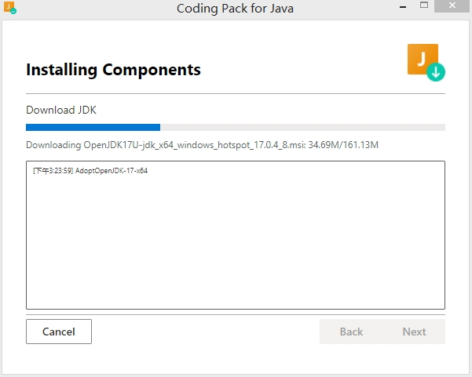

# Lesson 2: Hello world! - First Java code

## 1. Install Java development

ref: https://code.visualstudio.com/docs/java/java-tutorial

- 安装包Coding Pack for Java

includes VS Code, the Java Development Kit (JDK), and essential Java extensions.

## 2. install VSCode extensions

## `Hello World`

- VSC 有代码提示功能,可以自动生成代码

